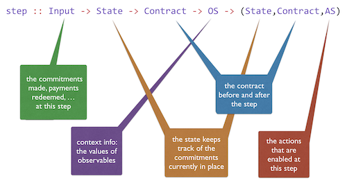

# Marlowe as a Haskell data type

This tutorial formally introduces Marlowe as a Haskell data type, building on the escrow example in the previous tutorial. It also describes the different types used by the model, as well as discussing a number of assumptions about the infrastructure in which contracts will be run.

## Marlowe

The Marlowe domain-specific language (DSL) is modelled as an algebraic type in Haskell. 

```haskell
data Contract =
   Null |
   CommitCash IdentCC Person Money Timeout Timeout Contract Contract |
   RedeemCC IdentCC Contract |
   Pay IdentPay Person Person Money Timeout Contract |
   Both Contract Contract |
   Choice Observation Contract Contract |
   When Observation Timeout Contract Contract
```

## The model types

A running contract interacts with its environment in two ways, as shown here.


### Observables 

First, it  needs to _observe_ different kinds of varying quantities including, for example, the current time, the current block number and, random numbers, as well as “real world” quantities like “the price of oil” or “the exchange rate between currencies A and B”. As the examples illustrate, observables come both from aspects of the blockchain (e.g. the current block or slot number) and externally. In the latter case, it will be necessary to agree between all participants of the contract a trusted oracle or source of information. 
Each instance of such an observable will be observed at a particular time and in a particular context. 

<!--We assume that the system infrastructure ensures that these values are recorded on the blockchain to allow the computation to be repeated for verification purposes.
-->
It is assumed that at each step of the execution of the contract, the values of observables will be available if needed, and these values are (together) given by a value of type `OS` (for “observable set”), where individual observations are described in a “little language” for that purpose: `Observation`. Note that these values are not determined by the participants in the contract, but rather by the external environment in which the contract is run.

### Inputs and Commitments 

On the other hand, at each step there are – potentially, at least – a variety of inputs available from the participants themselves. These include commitments of currency (or “cash”), redemption of commitments, and claims of payments by a participant. Moreover, it is also possible for a participant to input an arbitrary value (which we term a “choice”). The particular inputs at a given step are described by a value of type `Input`.

While informally we might see a commitment to something as being indefinite, as noted earlier it is important to realise that, on blockchain, a commitment needs to have a timeout so that progress can be forced in a contract. After the timeout period the cash can be refunded through the user creating a transaction to reclaim the cash. Information about the commitments currently in force forms the `State`, which can be modified at each execution step.

### Actions 

Payments can be granted by using committed money, but they must be manually redeemed by the recipient, in the same way that cash commitments are redeemed when they expire. The effects of the contract in the blockchain are represented by a list `AS` of `Actions` that is derived from the execution of each step of the semantics.

### Infrastructure 

The model makes a number of assumptions about the blockchain infrastructure in which it is run.
- It is assumed that cryptographic functions and operations are provided by a layer external to the system, and so they need not be modelled explicitly.
- We assume that time is “coarse grained” and measured by block or slot number, so that, in particular, timeouts are delimited using block/slot numbers.
- Making a commitment is not something that a contract can perform; rather, it can request that a commitment is made, but that then has to be established externally: hence the input of (a set of) commitments at each step.
- The model manages the release of funds back to the committer when a cash commitment expires (see discussion of the stepBlock function below).
 

### Computation 

Computation is modelled at two different levels.

The step function represents a single computation step and has this type:
```haskell
step :: Input -> State -> Contract -> OS -> (State,Contract,AS)
```
which is also illustrated here: 



The `step` function is total, so that for every contract a result of stepping is defined. However, for some kinds of contracts – commits, redeems or time-shifted contracts – it is possible that performing a step produces the same contract as the result; we call these _quiescent_ steps whereas all others make progress. We use this distinction in the explanation that follows.

Execution of a contract will involve multiple blocks, with multiple steps in each block. The computation at a single block is given by the `stepBlock` function: this will call the `stepAll` function that calls `step` repeatedly until it is quiescent.
In addition to calling `stepAll`, `stepBlock` will first enable expired cash commitments to be refunded and record, in the state, any choices made at that step. The functions `stepAll` and `stepBlock` have the same type as `step` itself.


## Where to go to find out more 
- blah

### [Prev](./escrow-ex.md) [Up](./Tutorials.md) [Next](./escrow-ex.md)