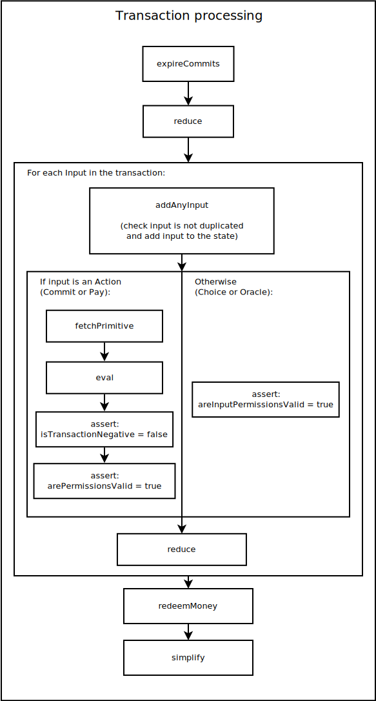

# The semantics of Marlowe 2.0

This tutorial gives a high-level formal semantics of Marlowe 2.0 by describing the types of inputs supported, and the main semantic functions.

In general, participants in a Marlowe contract communicate with the contract by issuing _transactions_. At each block, a sequence of zero or more transactions can be processed – in sequence – by a contract.

From the point of view of the semantics, a transaction consists of a list of inputs, and the whole transaction may be _signed_ by one or more participants. Concretely, we represent a transaction as a list of `AnyInput`s together with a set of integers representing the set of signatories.

As we mentioned in [the previous tutorial](./marlowe-data.md), inputs can have one out of four kinds: `Commit`, `Pay`, `Choice`, and `Oracle`. Of these, `Commit` and `Pay` are considered to be _actions_ and are typically associated with the transfer of money between a participant and the contract. `Choice` and `Oracle` are used to provide information from the external world to the contract.

## The `applyTransaction` function

The effect of executing a transaction in a Marlowe contract is modelled by the top-level function `applyTransaction`. This takes the transaction to process and the current state of the contract (including the internal state, the remaining contract, and the amount of funds remaining in the contract), and it returns the new state of the contract together with the amount of money that each participant is supposed to transfer to or from the contract as part of the transaction.

<p align="center">
 
</p>

The `applyTransaction` function has the following Haskell type:

```haskell
applyTransaction :: [AnyInput] -> S.Set Person -> BlockNumber -> State -> Contract -> Integer
                    -> MApplicationResult (Integer, TransactionOutcomes, State, Contract)
```

In turn, the `applyTransaction` function calls three principal auxiliary functions: `reduce`, `fetchPrimitive`, and `eval`.

- The `reduce` function is applied before and after every input, 
- `fetchPrimitive` is applied only for inputs that are actions (i.e: `Commit` and `Pay` inputs), and 
- `eval` is applied to the result of `fetchPrimitive` whenever appropriate.

In addition to these three functions, there are three additional functions that are applied in every transaction. Before processing the inputs, the function `expireCommits` is applied, and after processing the inputs the functions `redeemMoney` and `simplify` are applied.

<p align="center">
  
</p>

## Action processing

Let us start by looking at the parts of the processing that the semantics does exclusively for actions (that is, inputs of the kind `Commit` and `Pay`).

An action is represented by its `IdAction`. The function `fetchPrimitive` will traverse the parts of the contract that are currently in force (activated) and look for a primitive that matches the `IdAction` provided by the input. `fetchPrimitive` will only succeed if there is exactly one primitive that corresponds to the given `IdAction`. If it succeeds, `fetchPrimitive` will return a `DetachedPrimitive`:

```haskell
data DetachedPrimitive = DCommit IdCommit Person Integer Timeout
                       | DPay IdCommit Person Integer
```

`fetchPrimitive` will also return the contract after removing the chosen primitive; this new contract will be taken as the remaining contract if the evaluation succeeds. The `DetachedPrimitive` is the passed to `eval`, together with the current `State` of the contract.

### `Commit`

A `Commit` allows a participant `person` to transfer to the contract an amount of money `value`. This money will be recorded in the contract under the identifier `idCommit` and future payments can use this identifier as a source o money. Once the block specified by `timeout` (second `Timeout` in `Commit`) is reached, any money from the `Commit` that has not been spent (through payments) will be frozen, and the participant that performed the commitment will be able to withdraw with the next transaction that he or she signs.

```haskell
eval (DCommit idCommit person value timeout) state =
  if (isCurrentCommit idCommit state) || (isExpiredCommit idCommit state)
  then InconsistentState
  else Result ( addOutcome person (- value) emptyOutcome
              , addCommit idCommit person value timeout state )
              NoProblem
```

For a commitment to be valid, no commitment with the identifier `idCommit` must have been issued before (only one `Commit` per identifier is allowed).

In addition, `reduceRec` (the auxiliar function of `reduce`) specifies that a `Commit` will be reduced to its second `continuation` if any of the timeouts are reached.

```haskell
reduceRec blockNum state env c@(Commit _ _ _ _ timeout_start timeout_end _ continuation) =
  if (isExpired blockNum timeout_start) || (isExpired blockNum timeout_end)
  then reduceRec blockNum state env continuation
  else c
```

The `fetchPrimitive` function will use the first continuation (the first `Contract` in `Commit`) instead.

### `Pay`

A `Pay` allows a participant `person` to claim from the contract an amount of money `value`. This money will be discounted from the money committed under the identifier `idCommit`, and the contract will only pay up to the amount that remains available under `idCommit`, even if there is extra money available in the contract. In any case, `Pay` will pay no money if the commit `idCommit` has expired.

```haskell
eval (DPay idCommit person value) state =
  if (not $ isCurrentCommit idCommit state)
  then (if (not $ isExpiredCommit idCommit state)
        then Result (emptyOutcome, state) CommitNotMade
        else Result (emptyOutcome, state) CommitIsExpired)
  else (if value > maxValue
        then Result ( addOutcome person maxValue emptyOutcome
                    , fromJust $ discountAvailableMoneyFromCommit idCommit maxValue state )
                    NotEnoughMoneyLeftInCommit
        else Result ( addOutcome person value emptyOutcome
                    , fromJust $ discountAvailableMoneyFromCommit idCommit value state )
                    NoProblem)
  where maxValue = getAvailableAmountInCommit idCommit state

```

Regarding `reduceRec`, `Pay` behaves similarly to `Commit` except in that `Pay` only has one `Timeout`; `Pay` will be reduced to its second `continuation` if its timeout is reached before it is claimed.

```haskell
reduceRec blockNum state env c@(Pay _ _ _ _ timeout _ continuation) =
  if isExpired blockNum timeout
  then reduceRec blockNum state env continuation
  else c
```

Again, the `fetchPrimitive` function will use the first continuation (the first `Contract` in `Pay`) instead.


### [Prev](./marlowe-data.md) [Up](./README.md) [Next](./embedded-marlowe.md)