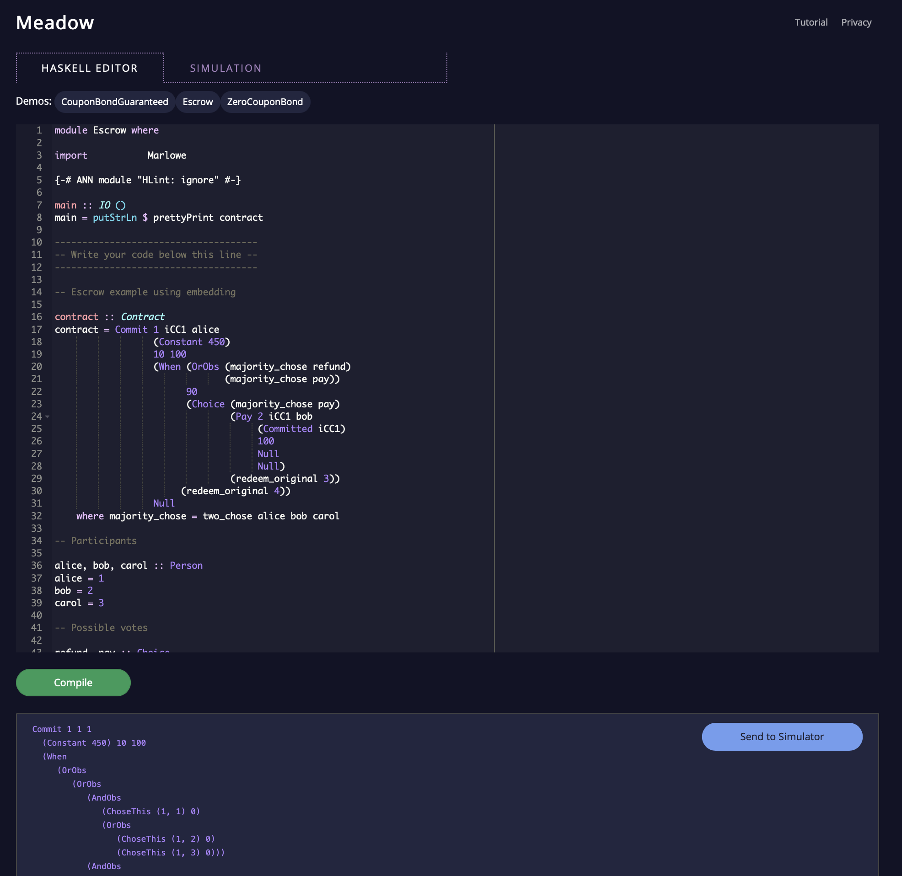
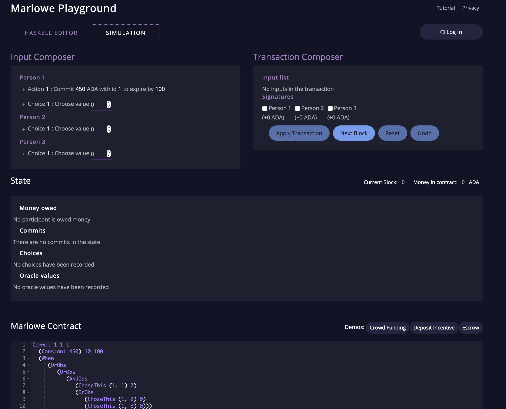
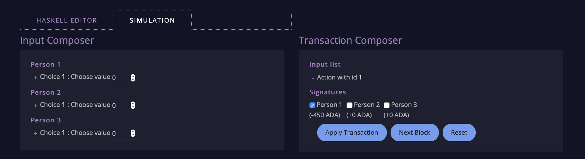
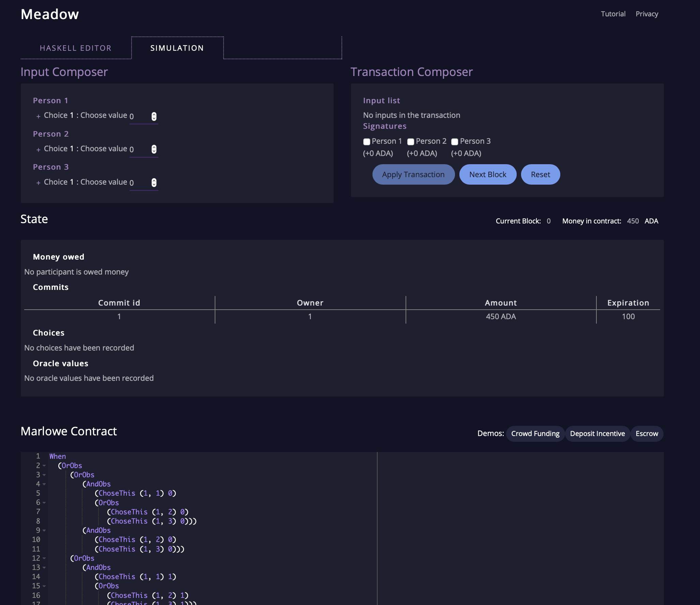
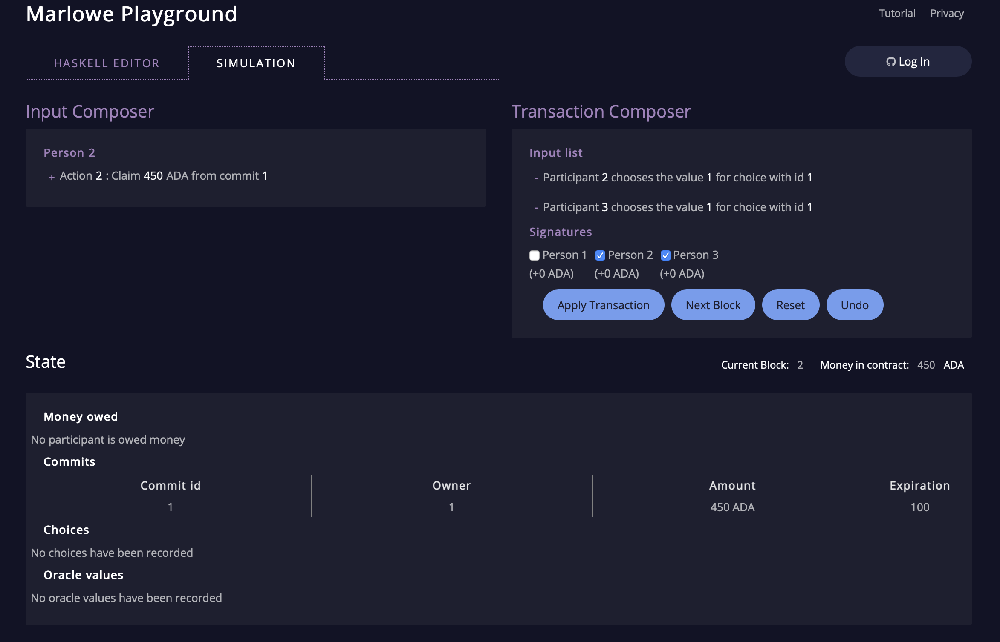
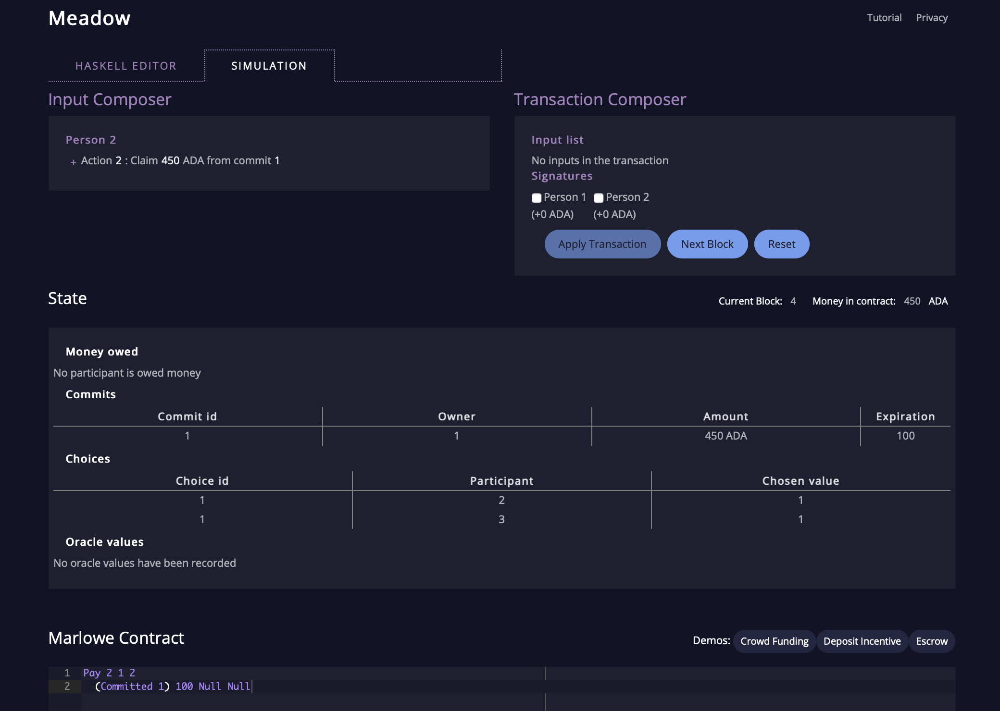

# Meadow in the cloud

This tutorial gives an overview of Meadow in the cloud, an online tool that allows users to interact with and simulate the operation of embedded Marlowe contracts. Meadow is available at [https://prod.meadow.marlowe.iohkdev.io](https://prod.meadow.marlowe.iohkdev.io).

## Introducing Meadow in the cloud

For Marlowe to be usable in practice, users need to be able to understand how contracts will behave once deployed to the blockchain, but without doing the deployment. We can do that by simulating their behaviour off-chain, interactively stepping through the evaluation of a contract in the browser-based tool, Meadow in the cloud, a web tool that supports the interactive construction, revision, and simulation of smart-contracts written in Marlowe V2.0.

 We do this in two stages, represented by two tabs in the tool:

- in the first we can design and edit a Marlowe contract, using features of Haskell, and then transform it to a pure Marlowe contract, and
- in the second we interact with that pure Marlowe contract, simulating inputs from participants, observations, and so forth.

## Developing embedded contracts

The editor supports Haskell development, with syntax highlighting, and on clicking the **Compile** button the Haskell file will be compiled, and the top-level definition of `contract` will be evaluated to a pure Marlowe contract, which is made visible below the Haskell pane. Once we are happy with the result, we can send it to the simulator pane by clicking **Send to simulator**.

The figure shows a screenshot of Meadow in the middle of developing an “Escrow” contract; other contract examples, based on the [ACTUS](./actus-marlowe.md) standard, can be loaded by clicking on the named **Demos** below the **HASKELL EDITOR** tab.

## Simulating Marlowe contracts

The second tab in Meadow allows users to simulate Marlowe contracts transaction by transaction. Typically these are contracts first developed in the Haskell editor, but it is also possible to modify the contract under execution, shown in the **Marlowe Contract** pane at the foot of the page. At each stage in execution, this shows the contract _still to be executed_. 

Other facilities presented by the tool are

- Towards the top of the screen, the **Input Composer** which provides us with all the  actions, choices and observations _that are relevant at this stage of contract execution_. This smart interface helps us to validate contracts: are we being offered what we would expect at each stage in the execution?

- The inputs are gathered in the **Transaction Composer**, where inputs are sequenced and then the whole transaction can be signed by any participants. Again, the interface is smart in suggesting which signatories there might be for the transaction.

- Once a transaction is composed, it can be applied by choosing the
  - **Apply Transaction** button applies the transaction, also
  - the **Next Block** button can be applied at any time to advance to the next block without applying any (more) transactions, and
  - the **Reset** button is used to reset the contract and state to their initial values.

- As the contract is evaluated, the internal state of the system changes, and this is reflected in the values show in the  **State** section in the middle of the screen. We revisit this below.

## Building inputs and transactions

We can build our first transaction by selecting the purple plus symbol `+` to the left of the potential inputs. If we select the first action – a commitment by `alice` – we see

where this potential action has disappeared, and the signatories now contain person 1. And under the signatures we can see that the transaction is expecting to obtain 450 ADA from person 1. If we choose to apply this transaction, we then see this
commitment by `alice` – we see the following changes in the screen.

- The input composer presents a different set of potential inputs, with the commitment _removed_.
- The transaction composer is reset, too.
- The state now shows that there is an active commitment, and gives its id, owner, value and time to expire (timeout).
- The contract has also evolved to a `When` construct that waits for a choice.

We could then advance to the next block, or indeed a number of steps, and the current block is shown below the three buttons, together with the amount of money committed to the contract.

Taking another step to reflect that Alice has received the cat from Bob, participants 2 (Bob) and Carol (3) choose value 1, and make that into a transaction:

Applying that transaction makes the contract evolve to the payment of the money to Bob, as is reflected in the potential action shown in the input composer here.

> __Exercise__
>  
> Use Meadow to interact with the `escrow` contract in the various scenarios discussed earlier, in the tutorial on [using Marlowe](./using-marlowe.md).
>
> Explore making some changes to the contract, and interactions with those modified contracts.
> 

> __Exercise__
>  
> Use Meadow to explore the other contracts presented in Meadow: the deposit incentive contract, and the crowd-funding example.
> 

### [Prev](./using-marlowe.md)  [Up](./README.md) [Next](./actus-marlowe.md)
