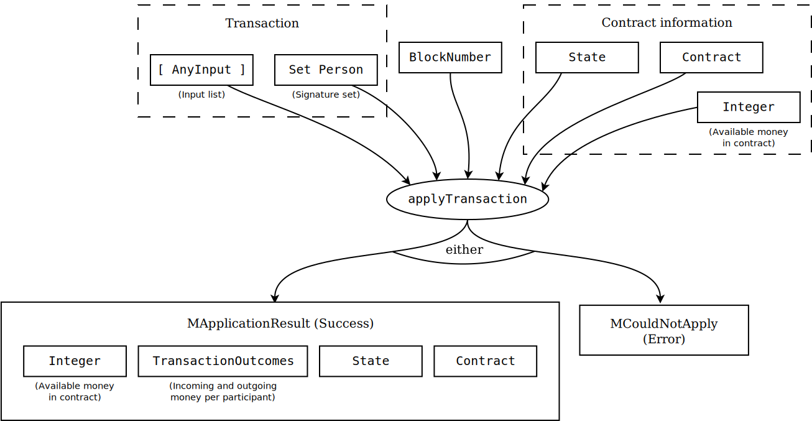

# Using Marlowe

This tutorial shows you how to use Marlowe from within Haskell, and in particular shows how to exercise a contract using the semantics given in the [earlier tutorial](./marlowe-semantics.md).

## Marlowe in Haskell

This tutorial works in `v2.0` of Marlowe which can be found under semantics-2.0 in the `master` branch of the repository:
```bash
git clone https://github.com/input-output-hk/marlowe.git
cd semantics-2.0
```

## Stepping through contracts

As we saw in the [semantics for Marlowe](./marlowe-semantics.md) the semantics of a single transaction are defined by the function `applyTransaction` of type:
 ```haskell
applyTransaction :: [AnyInput] -> S.Set Person -> BlockNumber -> State -> Contract -> Integer
                    -> MApplicationResult (Integer, TransactionOutcomes, State, Contract)
```

As illustrated by the diagram:

<p align="center">
 
</p>

We can use the facilities of `ghci` to step through a contract one transaction at a time, and, here, we will do that with the embedded escrow contract contained in [`Escrow.hs`](https://github.com/input-output-hk/marlowe/blob/master/semantics-2.0/examples/pure/Escrow.hs).

To single step, you can work in `ghci` like this, using the facility to make local bindings:

```haskell
*Build Data.Set> let (MSuccessfullyApplied (am1, to1, st1, c1) r1) = applyTransaction inputList1 (Data.Set.fromList sigList1) blockNum1 emptyState initialContract 0
*Build Data.Set> let (MSuccessfullyApplied (am2, to2, st2, c2) r2) = applyTransaction inputList2 (Data.Set.fromList sigList2) blockNum2 st1 c1 am1
*Build Data.Set> let (MSuccessfullyApplied (am3, to3, st3, c3) r3) = applyTransaction inputList3 (Data.Set.fromList sigList3) blockNum3 st2 c2 am2
*Build Data.Set> ...
```

Where `inputList`s are lists of inputs that may include any number of inputs depending on the context, and `sigList`s are lists of participant identifiers that represent the signatories of the transaction and there may also be any number of them.

We can then explore the values produced. Note, however, that the local bindings are lost each time a `:load` or `:l` command is performed.

An alternative way of doing this is to add these definitions to a working file, e.g. `Build.hs`, where these definitions will be preserved. Indeed, it would be very sensible to include some of the definitions used above in such a file.

The earlier description of the [semantics](./marlowe-semantics.md) concentrated on the high-level steps taken, and did not cover the constituent types in much detail. These are all defined in [`Semantics.hs`](https://github.com/input-output-hk/marlowe/blob/master/semantics-2.0/Semantics.hs)

## State

The `State` of a Marlowe contract keeps track of the `choices` made by users, the last value provided by each of the `oracles`, and the `IdAction`s already issued (`usedIds`).

```haskell
data State = State { commits :: CommitInfo
                   , choices :: M.Map IdChoice Choice
                   , oracles :: M.Map IdOracle (BlockNumber, Integer)
                   , usedIds :: S.Set IdAction}
```

In addition to these, the `State` keeps important information related to `commits`:
* Who committed the money for each commit? When does each commit expire? How much money is left in each commit? (`currentCommitsById`)
* Has a commit expired? (`expiredCommitIds`)
* Which commits expire when? (`timeoutData`)
* And it also keeps track of how much money is owed to each participant derived from commits that have expired already (`redeemedPerPerson`).

```haskell
type TimeoutData = M.Map Timeout (S.Set IdCommit)

data CommitInfo = CommitInfo { redeemedPerPerson :: M.Map Person Integer
                             , currentCommitsById :: M.Map IdCommit (Person, Integer, Timeout)
                             , expiredCommitIds :: S.Set IdCommit
                             , timeoutData :: TimeoutData }
```

## Inputs

For the contract to progress, it needs to be presented with inputs, as represented by the `AnyInput` type, which has four types grouped in two supertypes:

```haskell
data AnyInput = Action IdAction
              | Input Input
               deriving (Eq,Ord,Show,Read)
```

### Actions

For any action, we only need to specify the `IdAction`, since the rest of information should already be in the contract. But they can be two types: `Commit` and `Pay`.

### Normal inputs

The rest of inputs can be of two types: `Choice` and `Oracle`.

```haskell
data Input = IChoice IdChoice Choice
           | IOracle IdOracle BlockNumber Integer
```

## Back to single stepping

To single step through the escrow contract we construct three transaction to represent: a commitment, two choices being made and a payment. Together these represent the successful execution of the escrow contract: Alice gets the cat, and Bob the money.

```haskell
*Escrow Data.Set> let (MSuccessfullyApplied (am1, to1, st1, c1) r1) = applyTransaction [Action 1] (Data.Set.fromList [1]) 0 emptyState escrow 0
*Escrow Data.Set> let (MSuccessfullyApplied (am2, to2, st2, c2) r2) = applyTransaction [Input (IChoice (1, 2) 1), Input (IChoice (1, 3) 1)] (Data.Set.fromList [2, 3]) 1 st1 c1 am1
*Escrow Data.Set> let (MSuccessfullyApplied (am3, to3, st3, c3) r3) = applyTransaction [Action 2] (Data.Set.fromList [2]) 2 st2 c2 am2
```

Why is single stepping useful? It is the equivalent of debugging, and we are able to see the internal state of the contract at each stage, the contract continuation, i.e. what remains to be executed, and the actions produced at each step.

> __Exercise__
>  
> Explore some other ways of engaging with the contract
> - What happens when two participants choose to refund the money to Alice? 
> - What happens if Bob requests a payment before the choice is made to make the payment to him?
> - What happens if the contract reaches timeout? 

## There must be an easier way!

Yes, there is! 
       
We look next at how we can build a tool, Meadow, that will capitalise on the fact that we are working in a DSL to _automate_ picking the right inputs and allow users to interact with contracts.


### [Prev](./embedded-marlowe.md) [Up](./README.md) [Next](./playground-overview.md)
